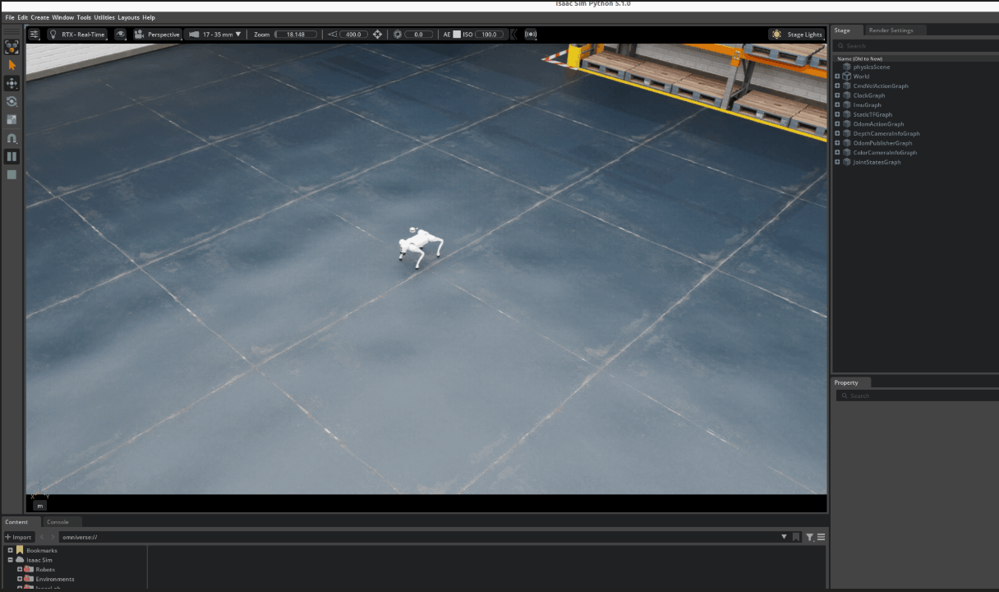

## System Requirements

| Component| Minimum                                   | Good                                   | Ideal                                    |
|----------|-------------------------------------------|----------------------------------------|------------------------------------------|
| OS       | Ubuntu 20.04 / 22.04                      | Ubuntu 20.04 / 22.04                   | Ubuntu 20.04 / 22.04                     |
| CPU      | Intel Core i7 (7th Gen)<br>AMD Ryzen 5    | Intel Core i7 (9th Gen)<br>AMD Ryzen 7 | Intel Core i9, X-series or higher<br>AMD Ryzen 9, Threadripper or higher |
| Cores    | 4                                         | 8                                      | 16                                       |
| RAM      | 32 GB                                     | 64 GB                                  | 64 GB                                    |
| Storage  | 50 GB SSD                                 | 500 GB SSD                             | 1 TB NVMe SSD                            |
| GPU      | GeForce RTX 3070                          | GeForce RTX 4080                       | RTX Ada 6000                             |
| VRAM     | 8 GB                                      | 16 GB                                  | 48 GB                                    |

## Features

- Isaac Sim: Realistic physics simulation of the Unitree Go2.
- Navigation Stack (Nav2): Fully configured navigation stack for autonomous movement.
- SLAM: Mapping capabilities using slam_toolbox.
- LiDAR Support: Simulation of Velodyne VLP-16 and Unitree 4D LiDAR.

## Simulation Instructions

To get started with **Isaac Sim** and **Unitree SDK**, please install cyclonedds and **ROS2 Humble** first.

Install cyclonedds from this [link](https://cyclonedds.io/docs/cyclonedds/latest/installation/installation.html) or follow the instructions below.

```bash
sudo apt-get install git cmake gcc
```

```bash
git clone https://github.com/eclipse-cyclonedds/cyclonedds -b releases/0.10.x
cd cyclonedds && mkdir build install && cd build
cmake -DBUILD_EXAMPLES=ON -DCMAKE_INSTALL_PREFIX=$HOME/Documents/GitHub/cyclonedds/install ..
cmake --build . --target install
```

To install ROS2 Humble, go to this [link](https://docs.ros.org/en/humble/Installation/Ubuntu-Install-Debs.html). Follow the steps under Setup Sources.

Now, run

```bash
sudo apt update
sudo apt upgrade
sudo apt install ros-humble-desktop
```

This will install ROS and all the relevant packages.

To install compilers and other tools to build ROS packages, run

```bash
sudo apt install ros-dev-tools
```

Install the following additional dependencies

```bash
sudo apt install ros-humble-rmw-cyclonedds-cpp
sudo apt install ros-humble-rosidl-generator-dds-idl
```

Set up your environment by sourcing the following file.

```bash
source /opt/ros/humble/setup.bash
```

If you don't have uv installed, use the following command to install it on your system.

```bash
curl -LsSf https://astral.sh/uv/install.sh | sh
```

Use this **CycloneDDS** configuration. It uses `lo` as the network interface. We recommend that you export this in your `.bashrc` or equivalent configuration file `cyclonedds.xml`.

To add it to `cyclonedds.xml`:

```bash
cd cyclonedds
vi cyclonedds.xml
```

Add the following, then save and exit.

```xml
<CycloneDDS>
    <Domain>
        <General>
            <Interfaces>
                <NetworkInterface address="127.0.0.1" priority="default" multicast="default" />
            </Interfaces>
        </General>
        <Discovery>
            <MaxAutoParticipantIndex>200</MaxAutoParticipantIndex>
        </Discovery>
    </Domain>
</CycloneDDS>
```

Open your bashrc file

```bash
vi ~/.bashrc
```

Add the following, replacing `/path/to/cyclonedds` with the actual path to your CycloneDDS installation:

```bash
export RMW_IMPLEMENTATION=rmw_cyclonedds_cpp
export CYCLONEDDS_URI=/path/to/cyclonedds/cyclonedds.xml
```

Apply the changes
```bash
source ~/.bashrc
```

To add the config to your bashrc, run:

```bash
vim ~/.bashrc
```

And add the following, replacing `/path/to/cyclonedds` with the actual path to your CycloneDDS installation:

```bash
export RMW_IMPLEMENTATION=rmw_cyclonedds_cpp
export CYCLONEDDS_URI='
<CycloneDDS>
    <Domain>
        <General>
            <Interfaces>
                <NetworkInterface address="127.0.0.1" priority="default" multicast="default" />
            </Interfaces>
        </General>
        <Discovery>
            <MaxAutoParticipantIndex>200</MaxAutoParticipantIndex>
        </Discovery>
    </Domain>
</CycloneDDS>'
```

Now run

```bash
source ~/.bashrc
```
This will apply the latest changes in the current shell session.

Check if you have rosdep installed by running `rosdep` or `rosdep --version`. If it is not installed, run the following:

```bash
sudo apt-get update
sudo apt-get install python3-rosdep
```

Once you've successfully completed above steps, follow the following steps to start the Isaac Sim simulation with OM1.

Step 1: Clone the [OM1-ros2-sdk](https://github.com/OpenMind/OM1-ros2-sdk) repository:

```bash
git clone https://github.com/OpenMind/OM1-ros2-sdk.git
```

Step 2: Install all the necessary dependencies:

```bash
cd OM1-ros2-sdk
uv venv --python 3.10

sudo rosdep init
rosdep update
rosdep install --from-paths . --ignore-src -r -y

source .venv/bin/activate
uv pip install .
```

Step 3: Build all the packages:

```bash
colcon build
```

Step 4: Install Isaac Sim

Open a new terminal window and switch to `unitree/isaac_sim` directory within `OM1-ros2-sdk`

```bash
cd OM1-ros2-sdk/unitree/isaac_sim

uv venv --python 3.11 --seed env_isaacsim

source env_isaacsim/bin/activate

# note that here we are installing IsaacSim 5.1
pip install "isaacsim[all,extscache]==5.1.0" --extra-index-url https://pypi.nvidia.com

# install the following or another CUDA-enabled PyTorch build that matches your system architecture

pip install -U torch==2.7.0 torchvision==0.22.0 --index-url https://download.pytorch.org/whl/cu128

# after installation, run the following to test successful installation
isaacsim
```

If the previous command ran with no issues, Isaac Sim was installed successfully.

Step 5: Now, let's get our system ready to run OM1 with Isaac Sim. Open a terminal and run the following commands.

To run the script, export the following

> **Note**: a trained policy is required, which should contain the policy.pt, env.yaml, and deploy.yaml files

```bash
export ROS_DISTRO=humble
export LD_LIBRARY_PATH=$LD_LIBRARY_PATH:PATH_TO_VENV/env_isaaclab/lib/python3.11/site-packages/isaacsim/exts/isaacsim.ros2.bridge/humble/lib
```

> **Note:** Make sure to replace PATH_TO_VENV with the actual path to your virtual environment. We use `env_isaacsim` (Python 3.11) for Isaac Sim and `.venv` (Python 3.10) for other services like orchestrator due to compatibility requirements.

We support Isaac Sim for Unitree Go2 and G1. To run the simulation for Go2, run

```bash
source env_isaacsim/bin/activate
python3 run.py # using default policy
python3 run.py --policy_dir YOUR_POLICY_DIR # using your own policy
```

To run the simulation for G1, run

```bash
source env_isaacsim/bin/activate
python3 run.py --robot_type g1 # using default policy
python3 run.py --robot_type g1 --policy_dir YOUR_POLICY_DIR # using your own policy
```

You'll now be able to see Isaac Sim running on your system.



Step 6: Open a new terminal , switch to base directory `OM1-ros2-sdk` and run:

```bash
source install/setup.bash
ros2 launch go2_sdk sensor_launch.py use_sim:=true
```

This will bring up the `om/path` topic, enabling OM1 to understand the surrounding environment.

Step 7: Open a new terminal and run:

```bash
export PYTHONPATH=$PYTHONPATH:$(pwd)/.venv/lib/python3.10/site-packages
source install/setup.bash
ros2 launch orchestrator orchestrator_launch.py use_sim:=true
```

This will bring up the `orchestrator`, to consume data collected by `om1_sensor` for SLAM and Navigation.

Step 8: Run Zenoh Ros2 Bridge

To run the Zenoh bridge for the Unitree Go2, you need to have the Zenoh ROS 2 bridge installed. You can find the installation instructions in the [Zenoh ROS 2 Bridge documentation](https://github.com/eclipse-zenoh/zenoh-plugin-ros2dds)

After installing the Zenoh ROS 2 bridge, you can run it with the following command:

```bash
zenoh-bridge-ros2dds -c ./zenoh/zenoh_bridge_config.json5
```

Step 9: Start OM1

Refer to the [Installation Guide](../developing/1_get-started) for detailed instructions.

Then add the optional Python CycloneDDS module to OM1, run

```bash
uv pip install -r pyproject.toml --extra dds
```

Setup your API key in `.bashrc` file and run your simulation agent:

Get your API key from the [portal](https://portal.openmind.org), and add it to `bashrc`

```bash
vi ~/.bashrc
```

```bash
export OM_API_KEY="<your_api_key>"
```

Now, run the simulation agent

```bash
uv run src/run.py simulation
```

> **Note**: Update your agent name depending on robot type.

Congratulations! You have launched Isaac Sim with OM1 successfully.

### Control Methods

When keyboard control is enabled (default), use the following keys:

| Key | Action |
|-----|--------|
| `↑` or `Numpad 8` | Move forward |
| `↓` or `Numpad 2` | Move backward |
| `←` or `Numpad 4` | Strafe left |
| `→` or `Numpad 6` | Strafe right |
| `N` or `Numpad 7` | Rotate left |
| `M` or `Numpad 9` | Rotate right |

> **Note**: We don't have auto charging feature supported with Isaac Sim but it will be launched soon. Stay tuned!
